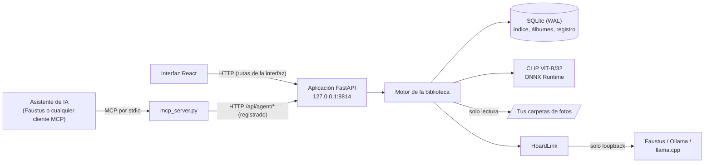

# El Tesoro de Argos

### ¿Sigues teniendo la foto del perro en la playa del verano pasado?

**Una fototeca privada que indexa tus carpetas en tu propio ordenador, entiende lo que aparece en cada imagen y le entrega a un modelo de IA local resultados de texto compactos y ordenados con honestidad, y una hoja de contactos numerada solo cuando el modelo puede ver imágenes.**

[English](README.md) · [Inicio rápido](#inicio-rápido) · [Conectarlo a Faustus](#conectarlo-a-faustus) · [Referencia MCP](docs/MCP.md) · [Portfolio](https://luissalet.github.io/Portfolio/#projects)


*Aplicación real con datos sintéticos: 87 imágenes generadas (degradados y formas simples, no fotos reales) con fechas EXIF, GPS de tres ciudades y duplicados colocados a propósito.*

## Por qué

Un modelo de lenguaje puede leer un archivo de texto, pero una carpeta
con 20.000 fotos es opaca para él: no sabe cuál es la de la pizarra de
marzo, dónde fue un viaje ni que hay tres copias de la misma foto
ocupando espacio. Pegar imágenes en un chat no escala, y describir fotos
a partir del nombre del archivo invita a inventar.

Argos indexa tus carpetas en tu propio equipo (embeddings de
imagen CLIP con ONNX Runtime, sin PyTorch y sin llamadas a la nube), lee
EXIF y GPS, geocodifica sin conexión y encuentra duplicados exactos y
aproximados. El modelo recibe resultados cortos, filtrados y numerados,
con identificadores estables y un grado de coincidencia (fuerte, media o
débil) en cada uno. Un modelo con visión puede pedir una sola hoja de
contactos con las candidatas y revisar diez fotos por el precio de una
imagen antes de afirmar nada; un modelo solo de texto nunca recibe una
imagen que no haya pedido. Argos nunca modifica,
mueve ni borra un archivo original; es un invariante con su test.

## Casos de uso

Ocho escenarios, recorridos en el navegador y, los del agente, por MCP
real con un script que hace de modelo local pequeño
([docs/USE_CASES.md](docs/USE_CASES.md); lo encontrado y lo corregido
está en [docs/USABILITY_REPORT.md](docs/USABILITY_REPORT.md)):

- **Primer arranque**: añadir `Imágenes` (sirve una ruta pegada con las
  comillas del Explorador), descargar el modelo de imagen en Ajustes
  mientras la barra cuenta los megas y buscar «sunset over the sea».
- **Una foto por contenido y fecha**: *«¿tienes la foto del perro en la
  playa del verano pasado?»*. El modelo busca «dog on the beach» con un
  rango de fechas, recibe solo texto y dice cuánta seguridad tiene.
- **Liberar espacio**: las copias exactas conservan el original del
  carrete, y «Copiar rutas de las copias extra» deja fuera la que se
  conserva; los duplicados aproximados se muestran como «hasta», para
  revisarlos grupo a grupo.
- **Álbumes desde el agente**: *«haz un álbum "Lisboa 2024" con todo el
  viaje»*: solo con filtros (`place="Lisbon"`, julio de 2024) y paginando
  con `next_offset` se cubre el viaje entero.
- **Con otras herramientas**: un retrato vertical para el CV que el
  asistente copia luego con sus propias herramientas de archivos, y las
  fotos de la claqueta y el croma del rodaje de un cortometraje reunidas en un
  álbum.
- **Recuerdos y lugares**: «un día como hoy» con lugares, y Lugares
  agrupado por país y ciudad.

## Qué está implementado

| Área | Disponible ahora | Límite |
| --- | --- | --- |
| Indexado | Escaneos incrementales en segundo plano: un archivo sin cambios cuesta un `stat`; los modificados se vuelven a leer; los movidos o renombrados conservan su id, su vector, su descripción y sus álbumes. Hash y decodificación en paralelo, progreso con archivos/s y tiempo restante, y un archivo ilegible se anota sin parar el escaneo. JPEG, PNG, WebP, GIF, BMP, TIFF y HEIC/HEIF | Sin vigilancia del sistema de archivos: los reescaneos los lanza el usuario, el agente o una carpeta nueva |
| Metadatos | Fecha EXIF con zona horaria, cámara, objetivo, exposición, ISO, focal, orientación y GPS; si no hay fecha EXIF se usa la del archivo y se indica | Solo EXIF; no lee archivos XMP |
| Búsqueda | Texto a imagen con CLIP ViT-B/32 (en inglés funciona mejor; las herramientas piden al modelo que traduzca), fotos parecidas y filtros (rango de fechas, año, mes, lugar, carpeta, cámara, orientación, megapíxeles, GPS). Híbrida con las descripciones cuando existen | El modelo (unos 600 MB) solo se descarga cuando el usuario lo pide en Ajustes. Hasta entonces funciona un modo básico que solo entiende colores, y cada resultado lo avisa |
| Duplicados | Exactos (BLAKE2b) y aproximados (pHash, distancia de Hamming hasta 6, búsqueda exacta multiíndice, union-find), con la copia recomendada (el original, no la copia de seguridad ni la del chat) y el espacio que ocupan las copias sobrantes | Solo lectura por diseño: «Copiar rutas de las copias extra» y «Abrir carpeta»; borrar es cosa tuya. Un grupo aproximado puede juntar fotos distintas que se parecen, así que su espacio se muestra como «hasta» |
| Lugares y tiempo | Geocodificación inversa sin conexión (tabla integrada de 10 ciudades o GeoNames `cities1000` bajo petición, donde cada barrio lleva la ciudad a la que pertenece: «Alfama, Lisbon, Portugal»), países y ciudades con recuentos, cronología por año y mes, «un día como hoy» | Sin mapas con teselas, para no hacer peticiones de red por una vista. La tabla integrada no ubica nada a más de 50 km de sus 10 ciudades |
| Descripciones | Opcionales, con un modelo de visión local que encuentra el backend compartido (ver más abajo), por foto o en lote en segundo plano, guardado en un índice de texto completo para la búsqueda híbrida | Desactivado por defecto; nunca se genera durante el indexado |
| Álbumes | Los creas tú o el agente, desde el visor o con una herramienta; el agente solo puede añadir | Sin álbumes anidados |
| Interfaz | Interfaz React de escritorio: cuadrícula de miniaturas con carga continua, visor con zoom y desplazamiento sobre una vista previa grande (1600 px) del original, panel EXIF, fotos parecidas, inglés y español, tema claro y oscuro | Las secciones de la barra lateral no tienen URL propia |
| Integración con el asistente | `faustus-plugin.json`, 9 herramientas MCP por stdio y cada llamada del agente registrada en «Actividad del asistente» | El agente puede añadir una carpeta, pero no quitarla |
| Modelos compartidos | Las descripciones y la traducción de búsquedas usan el modelo que ya tenga en marcha Faustus, o un Ollama/llama.cpp/servidor local compatible con OpenAI (Ajustes -> Modelos compartidos muestra qué se resolvió y por qué, con un ajuste manual) | La búsqueda de imágenes (CLIP) siempre es local: no es un modelo de chat que cubra el backend compartido |

## Modelos compartidos

Argos nunca carga su propia copia de un modelo de lenguaje o de visión.
Dos funciones pasan por [HoardLink](https://github.com/Luissalet/HoardLink),
un pequeño resolutor que llevan incluido las aplicaciones que comparten
modelos en el mismo equipo: las
**descripciones** de foto (capacidad `vision`) y la **traducción
automática** de la búsqueda (capacidad `llm`). El orden de resolución es
siempre el mismo: primero un ajuste manual guardado en Ajustes, luego un
Faustus en marcha, luego un servidor local Ollama / llama.cpp / compatible
con OpenAI que ya esté sirviendo un modelo adecuado -- así Argos nunca le
pide a la GPU que cargue una segunda copia. Si nada se resuelve, ambas funciones lo
dicen claramente y se quedan desactivadas (sus botones aparecen
deshabilitados con el motivo); el resto de Argos (indexado,
búsqueda, duplicados, cronología, lugares, álbumes) funciona sin conexión
y sin ningún modelo. Más detalle en
[docs/ARCHITECTURE.md](docs/ARCHITECTURE.md#shared-model-backend-hoard-link).


*Aplicación real: en esta demostración no hay ni Faustus ni un Ollama/llama.cpp local en marcha, así que ambas capacidades informan honestamente «No disponible» junto con el motivo.*

## Conectarlo a Faustus

Argos es un plugin de [Faustus](https://github.com/Luissalet/Faustus), un
espacio de trabajo de IA local, y se declara con `faustus-plugin.json`.
Arranca la aplicación y, en Faustus, abre **Conectores -> Aplicaciones cercanas -> Añadir**. Faustus
la encuentra en `127.0.0.1:8814`, lee el manifiesto del directorio de
trabajo de la aplicación y arranca él mismo el adaptador MCP.

| Herramienta | Qué hace | Solo lectura |
| --- | --- | --- |
| `photos_search` | Texto (en inglés) -> fotos con grado de coincidencia, filtros y paginación; hoja de contactos numerada solo si se pide | sí |
| `photos_similar` | Fotos que se parecen a una dada | sí |
| `photos_show` | Hasta 4 imágenes para verlas de cerca (200 KB como máximo cada una) | sí |
| `photos_describe` | EXIF, lugar y ruta; descripción local opcional | sí (la descripción pedida se guarda en la base de datos de Argos) |
| `photos_duplicates` | Grupos de duplicados exactos o aproximados con la copia recomendada | sí |
| `photos_timeline` | Recuentos por año y mes, «un día como hoy» | sí |
| `photos_library` | Carpetas, recuentos, modelo activo y trabajos en curso | sí |
| `photos_add_folder` | Registra una carpeta y la indexa | solo añade |
| `photos_album` | Crea o amplía un álbum | solo añade |

Funciona con cualquier cliente MCP por stdio:

```json
{
  "mcpServers": {
    "argus": {
      "command": "C:/ruta/a/argus-hoard/.venv/Scripts/python.exe",
      "args": ["C:/ruta/a/argus-hoard/argus_hoard/mcp_server.py"],
      "env": { "ARGUS_URL": "http://127.0.0.1:8814" }
    }
  }
}
```

En Linux o macOS el intérprete es `argus-hoard/.venv/bin/python`.

Argumentos, formato de las respuestas, códigos de error y límites:
[docs/MCP.md](docs/MCP.md). La guía que le dice al modelo cuándo y cómo
usar las herramientas: [skills/find-photos/SKILL.md](skills/find-photos/SKILL.md).


*Aplicación real: «sunset over the sea» con el modelo CLIP de verdad sobre las imágenes sintéticas.*


*El visor: vista previa del original, EXIF, lugar, descripción, álbumes y fotos parecidas.*

## Inicio rápido

Requisitos: Python 3.11 o posterior y Node.js 22 (solo para compilar la
interfaz la primera vez). El modelo de imagen no viene incluido: se
descarga desde Ajustes -> Modelo de imagen (unos 600 MB) cuando lo pidas;
hasta entonces la búsqueda solo entiende colores y lo avisa.

### Windows (PowerShell)

```powershell
git clone https://github.com/Luissalet/ArgusHoard.git
cd ArgusHoard
.\scripts\start.ps1 -Demo      # primera vez: crea .venv, instala el lock, compila la interfaz y abre el navegador
```

O doble clic en **`Iniciar Argus.cmd`** (y **`Detener Argus.cmd`** para
pararlo). Más opciones del lanzador:

```powershell
.\scripts\start.ps1              # tu propia biblioteca en data\
.\scripts\start.ps1 -Port 8820 -NoBrowser
.\scripts\stop.ps1
```

`start.ps1` prefiere Python 3.13 si está instalado en `C:\Python313`,
reinstala las dependencias cada vez que cambia `requirements-lock.txt`,
arranca la aplicación en segundo plano con el repositorio como directorio
de trabajo, espera a que responda `/api/health` y abre el navegador. Los
registros quedan en `data\logs\`. `stop.ps1` detiene el proceso que
escucha en el puerto tras comprobar que es Argos.

Los mismos pasos a mano:

```powershell
python -m venv .venv
.venv\Scripts\python -m pip install -r requirements-lock.txt
cd frontend; npm ci; npm run build; cd ..
.venv\Scripts\python -m argus_hoard --demo     # biblioteca sintética en data-demo\
.venv\Scripts\python -m argus_hoard            # tu propia biblioteca, http://127.0.0.1:8814
```

### Linux / macOS

```bash
git clone https://github.com/Luissalet/ArgusHoard.git
cd ArgusHoard
python3 -m venv .venv
.venv/bin/python -m pip install -r requirements-lock.txt
(cd frontend && npm ci && npm run build)
.venv/bin/python -m argus_hoard --demo --no-browser   # biblioteca sintética en data-demo/
curl http://127.0.0.1:8814/api/health                 # {"service":"argus-hoard",...}
```

Después abre <http://127.0.0.1:8814>. Opciones: `--port`, `--data-dir` (o
`ARGUS_DATA_DIR`), `--demo` y `--no-browser`. Todo lo que escribe Argos
vive en la carpeta de datos (`data/` por defecto, `data-demo/` con
`--demo`): base de datos, miniaturas, vectores, caché del modelo y
registros.

## Arquitectura

FastAPI y SQLite (WAL) alrededor de un motor en Python puro, una interfaz
React 19 + Vite y un adaptador MCP independiente que habla con la
aplicación por HTTP. Módulos, modelo de datos, pipeline de indexado,
hilos e índice de duplicados: [docs/ARCHITECTURE.md](docs/ARCHITECTURE.md).




*Duplicados aproximados en la biblioteca de demostración: cada copia reducida se agrupa con su original, la recomendada primero.*


*Cronología: meses con miniaturas de muestra; cada mes abre sus fotos.*

## Desarrollo

```bash
.venv/bin/python -m pytest -q            # 141 tests, unos 30 s, sin red ni GPU
.venv/bin/python -m pytest -q -m model   # 1 test opcional con el modelo CLIP real (lo descarga si falta)
(cd frontend && npm ci && npm run build) # TypeScript estricto
```

(En Windows: `.venv\Scripts\python -m pytest -q`.)

La batería por defecto comprueba: que los originales no cambian tras
indexar, buscar duplicados y crear álbumes; los reescaneos incrementales;
que un archivo movido conserva su id; que un archivo corrupto no para el
escaneo; que los escaneos simultáneos se ejecutan de uno en uno; que la
carpeta de datos nunca se indexa como fotos; que se vuelve a calcular el
embedding al cambiar de modelo; el EXIF tal como lo escriben las cámaras
(sub-IFD, tuplas, fechas a cero) y los signos del GPS; la orientación de
las miniaturas; todos los formatos admitidos, HEIC incluido; el índice de
duplicados aproximados frente a fuerza bruta con 8.000 hashes; union-find
y la regla de la copia recomendada; los límites de tamaño de la hoja de
contactos y de `photos_show`; el ranking del modo básico y que es
determinista entre procesos; el almacén de vectores; la geocodificación
con una tabla de prueba, incluida la ciudad a la que pertenece cada barrio
con filas reales de GeoNames; la validación de filtros, la paginación y
que un resultado vacío diga qué filtro relajar; la protección HTTP, los
intentos de salir de la carpeta de la interfaz y el formato de los
errores; el manifiesto; el adaptador MCP lanzado por stdio contra la
aplicación en marcha (lista de herramientas, anotaciones, imagen de la
hoja de contactos, `photos_show`, álbumes, errores y el mensaje cuando la
aplicación está parada); y el backend de modelos compartido (ajustes
manuales que nunca devuelven el token de Faustus, descripciones contra un
servidor simulado, un lote de descripciones que cede el paso y se aplaza
si el modelo está ocupado, un `backend.json` roto y la traducción de
búsquedas solo en la ruta de la interfaz). El test del modelo indexa las
escenas de demostración con CLIP real y comprueba que cuatro descripciones
en inglés encuentran la escena correcta.

La CI (`.github/workflows/ci.yml`) pasa la batería en Ubuntu y Windows con
Python 3.11, 3.12 y 3.13, compila la interfaz con Node 22 y prueba
`start.ps1`/`stop.ps1` en Windows.

## Privacidad y seguridad

- Solo escucha en `127.0.0.1`; rechaza las peticiones con otra cabecera
  `Host` (DNS rebinding) y las escrituras desde otros sitios. Sin CORS y
  sin telemetría.
- Las únicas peticiones a internet son las que lanzas en Ajustes: el
  modelo CLIP desde Hugging Face y los datos de GeoNames. Las
  descripciones y la traducción de búsquedas solo hablan con servidores de
  modelos en loopback (Faustus, Ollama, llama.cpp u otro compatible con
  OpenAI).
- Cada llamada del asistente queda registrada en **Actividad del
  asistente** (herramienta, argumentos, duración, resultado o error); los
  clics de la propia interfaz van por otras rutas y no se mezclan.
- Los originales solo se leen. Quitar una carpeta en Ajustes borra los
  datos propios de Argos sobre ella (filas del índice, miniaturas,
  entradas de álbumes), nunca los archivos. El agente puede añadir
  carpetas y álbumes, pero no quitar nada.
- Los nombres de lugares proceden de [GeoNames](https://www.geonames.org/)
  (CC BY 4.0) cuando se descarga el conjunto completo.

## Límites conocidos y hoja de ruta

- Sin vigilancia del sistema de archivos: los reescaneos los lanzas tú, el
  agente o una carpeta nueva.
- La búsqueda vectorial es por fuerza bruta (coseno): válida hasta unas
  200.000 fotos en un solo equipo; más adelante puede ir un índice ANN
  detrás de la misma interfaz.
- Un grupo de duplicados aproximados puede encadenar fotos distintas que
  se parecen, por eso su espacio se muestra como «hasta»; agruparlos de
  forma más estricta (limitar el diámetro del grupo, confirmar con CLIP)
  exige validarlo antes con fotos reales.
- Las copias idénticas byte a byte todavía pueden salir juntas en los
  resultados y en los álbumes.
- Aún no hay una lista de primeros pasos: un aviso ámbar y la marca de
  Ajustes llevan a descargar el modelo de imagen.
- Algunos motivos y nombres de países siguen saliendo en inglés en la
  interfaz en español.
- Los grados de coincidencia de CLIP y los umbrales de duplicados se
  ajustaron con imágenes sintéticas; falta comprobarlos con bibliotecas
  reales grandes.

Notas de diseño de los recorridos por los casos de uso:
[docs/USE_CASES.md](docs/USE_CASES.md),
[docs/USABILITY_REPORT.md](docs/USABILITY_REPORT.md).

## Licencia

[MIT](LICENSE).
