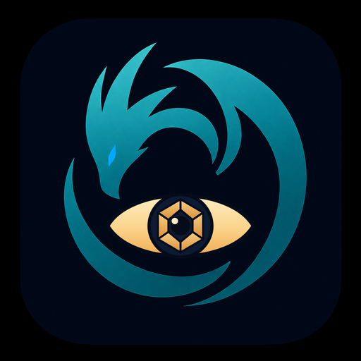
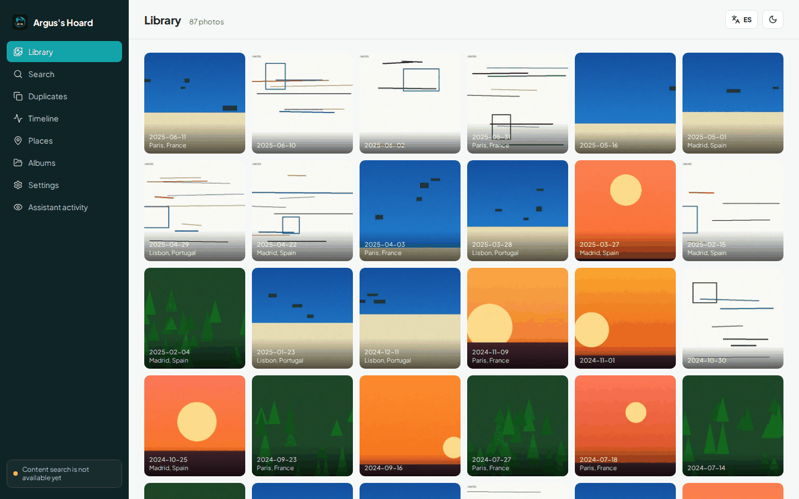
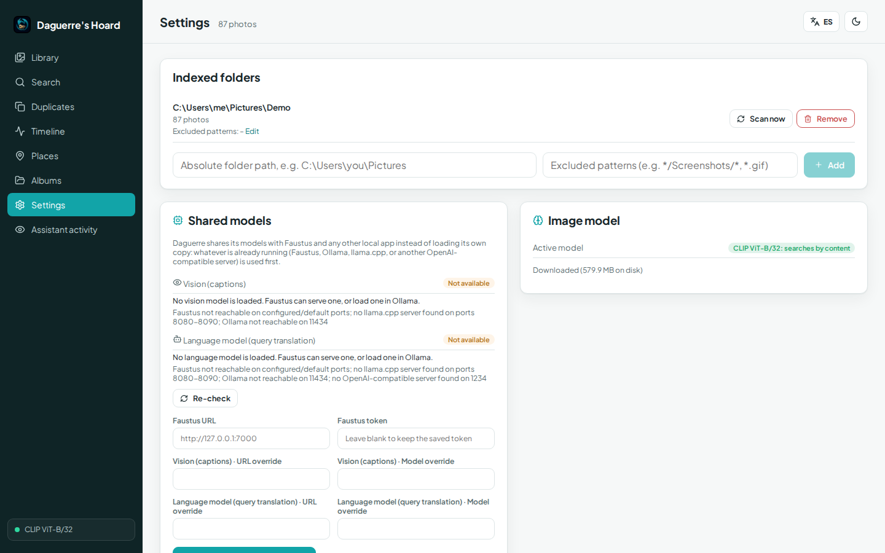
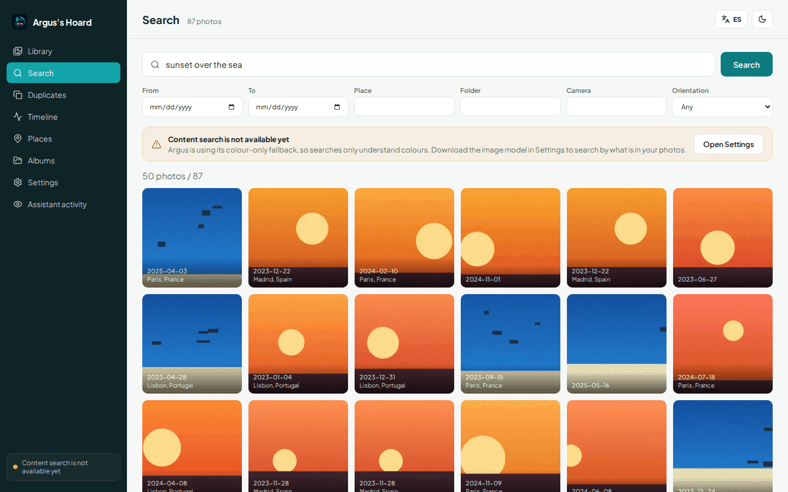
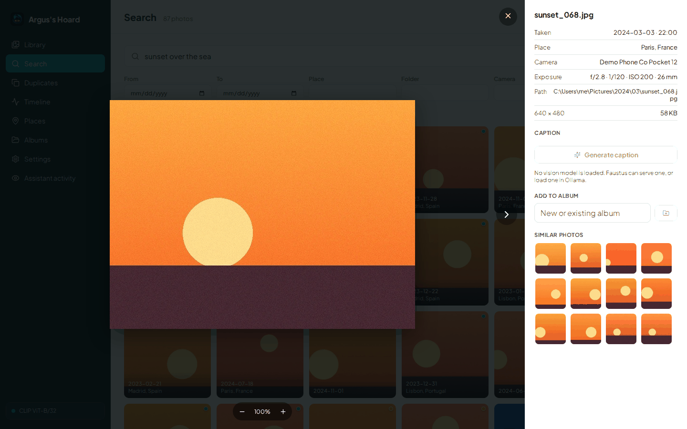
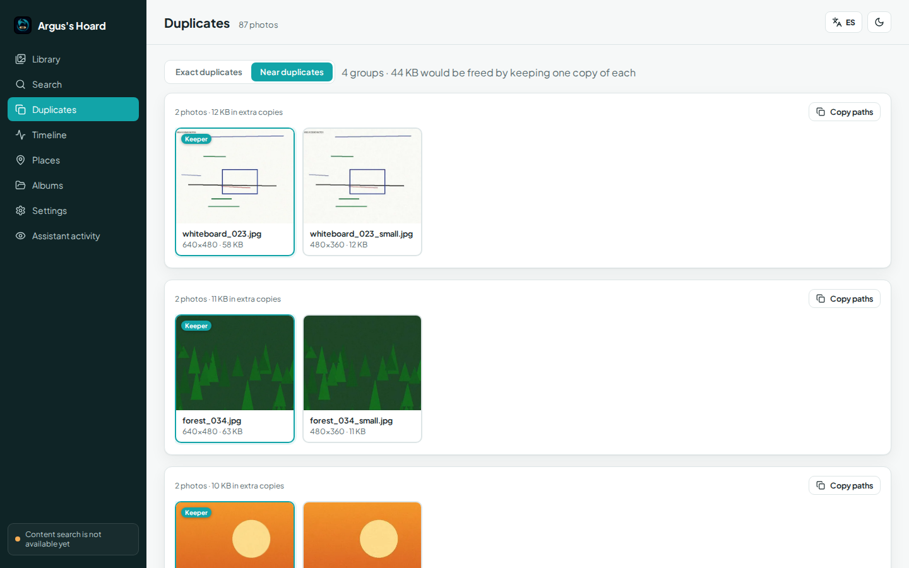
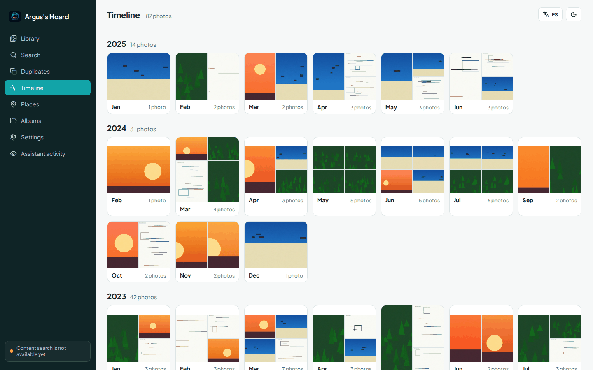

# Argus's Hoard

### Do you still have the photo of the dog on the beach from last summer?

**A private photo library that indexes your folders locally, understands what is in each picture, and hands a local AI model compact results plus one numbered contact sheet it can actually look at.**

[Español](README.es.md) · [Run locally](#run-locally-on-windows) · [Connect an AI](docs/MCP.md) · [Portfolio](https://luissalet.github.io/Portfolio/#projects)


*Actual application, synthetic demo data: 87 generated images (gradients and simple shapes, not real photos) with EXIF dates, GPS for three cities, and planted duplicates.*

## Why

A language model can read a text file, but a folder of 20,000 photos is
opaque to it: it cannot tell which one shows the whiteboard from March,
where a trip was, or that three copies of the same picture are taking up
space. Pasting images into a chat does not scale, and describing photos
from their file names invites confident guesses.

Argus indexes the owner's folders on their own machine (CLIP image
embeddings through ONNX Runtime, no PyTorch, no cloud call), reads EXIF
and GPS, reverse-geocodes offline, and finds exact and near duplicates.
The model gets short, filtered, numbered results with stable ids and a
single contact-sheet image of the candidates, so a vision model can check
ten photos for the price of one image before it claims anything. Argus
never modifies, moves or deletes an original file; that invariant is
tested.

## What is implemented

| Area | Available now | Boundary |
| --- | --- | --- |
| Indexing | Background, incremental scans: unchanged files cost one `stat`; changed files are re-read; moved or renamed files keep their id, vector, caption and albums. Parallel hashing and decoding, progress with files/s and ETA, one unreadable file is reported instead of stopping the scan. JPEG, PNG, WebP, GIF, BMP, TIFF, HEIC/HEIF | No file-system watcher: rescans are started by the user, the agent or a new folder |
| Metadata | EXIF date with time-zone offset, camera, lens, exposure, ISO, focal length, orientation, GPS; file time as fallback, flagged as such | EXIF only; XMP sidecars are not read |
| Search | Text to image with CLIP ViT-B/32 (English queries work best; the tools tell the model to translate), similar photos, filters (date range, year, month, place, folder, camera, orientation, megapixels, GPS). Hybrid with captions when they exist | The model (about 600 MB) is downloaded only when the user clicks it in Settings. Until then a colour-only fallback is active and every result says so |
| Duplicates | Exact (BLAKE2b) and near (pHash, Hamming distance up to 6, exact multi-index lookup, union-find) with a suggested keeper and the space that extra copies use | Read-only by design: "Copy paths" and "Open folder", deleting is up to the owner |
| Places and time | Offline reverse geocoding (bundled 10-city table, or GeoNames `cities1000` on request), countries and cities with photo counts, timeline by year and month, "on this day" | No map tiles, to avoid any network request for a view |
| Captions | Optional local Ollama vision model per photo or as a background batch, stored in a full-text index for hybrid search | Off by default; never generated during indexing |
| Albums | Created by the owner or the agent from the lightbox or by tool call; the agent can only add | No nested albums |
| Interface | React desktop-style UI: thumbnail grid with infinite scroll, lightbox with zoom and pan on a large (1600 px) preview of the original, EXIF panel, similar strip, English and Spanish, light and dark | Sidebar sections are not deep-linkable URLs |
| Assistant integration | `faustus-plugin.json`, 9 MCP tools over stdio, every agent call audited in "Assistant activity" | The agent can add a folder but not remove one |
| Shared models | Captions and query translation share whatever model server Faustus or a local Ollama/llama.cpp/OpenAI-compatible server already has running (Settings -> Shared models shows what resolved and why, with a manual override) | Image search itself (CLIP) is always local, never shared: it is not a chat model the shared backend covers |

## Shared models

Argus never loads its own copy of a language or vision model. Two features
go through Hoard Link, a small vendored resolver shared with the owner's
other local apps: photo **captions** (the `vision` capability) and
automatic **query translation** for the search box (the `llm` capability).
Resolution order is always the same: an explicit override set in Settings,
then a running Faustus, then a loopback Ollama / llama.cpp / OpenAI-compatible
server -- whichever is already serving a fitting model, so Argus never
asks a GPU to load a second copy. Both features simply say so and stay off
when nothing resolves; the rest of Argus (indexing, search, duplicates,
timeline, places, albums) works fully offline with no model at all. See
[docs/ARCHITECTURE.md](docs/ARCHITECTURE.md#shared-model-backend-hoard-link).


*Actual application: neither Faustus nor a local Ollama/llama.cpp server is running in this demo, so both capabilities honestly report "Not available" with the reason why.*

## Connect it to Faustus

Argus declares itself with `faustus-plugin.json`. Start the app, then in
Faustus open **Connectors -> Nearby apps -> Add**. Faustus finds it on
`127.0.0.1:8814`, reads the manifest from the app's working directory and
launches the MCP adapter itself.

| Tool | What | Read-only |
| --- | --- | --- |
| `photos_search` | Text (English) -> photos, filters, numbered contact sheet | yes |
| `photos_similar` | Photos that look like a given one | yes |
| `photos_show` | Up to 4 images for a closer look (200 KB each at most) | yes |
| `photos_describe` | EXIF, place, path; optional local caption | yes (a requested caption is saved in Argus's database) |
| `photos_duplicates` | Exact or near duplicate groups with a keeper | yes |
| `photos_timeline` | Counts per year and month, "on this day" | yes |
| `photos_library` | Folders, counts, active model, running jobs | yes |
| `photos_add_folder` | Register a folder and index it | adds only |
| `photos_album` | Create or extend an album | adds only |

It works with any MCP client over stdio:

```json
{
  "mcpServers": {
    "argus": {
      "command": "C:/path/to/argus-hoard/.venv/Scripts/python.exe",
      "args": ["C:/path/to/argus-hoard/argus_hoard/mcp_server.py"],
      "env": { "ARGUS_URL": "http://127.0.0.1:8814" }
    }
  }
}
```

Arguments, output shapes, error codes and limits: [docs/MCP.md](docs/MCP.md).
The skill that tells the model when and how to use the tools:
[skills/find-photos/SKILL.md](skills/find-photos/SKILL.md).


*Actual application: "sunset over the sea" with the real CLIP model on the synthetic demo images.*


*The lightbox: preview of the original, EXIF, place, captions, albums and visually similar photos.*

## Run locally on Windows

Requirements: Python 3.11 or newer (3.13 at `C:\Python313` is preferred)
and Node.js 22 for the first build of the interface.

Double-click **`Iniciar Argus.cmd`** (and **`Detener Argus.cmd`** to stop),
or from PowerShell:

```powershell
.\scripts\start.ps1              # first run: creates .venv, installs the lock, builds the UI
.\scripts\start.ps1 -Demo        # same, with the synthetic demo library in data-demo\
.\scripts\start.ps1 -Port 8820 -NoBrowser
.\scripts\stop.ps1
```

`start.ps1` reinstalls dependencies whenever `requirements-lock.txt`
changes, starts the app hidden with the repository as working directory,
waits for `/api/health` and opens the browser. Logs go to `data\logs\`.
`stop.ps1` stops the process listening on the port after confirming it is
Argus.

Manual steps:

```powershell
python -m venv .venv
.venv\Scripts\python -m pip install -r requirements-lock.txt
cd frontend; npm ci; npm run build; cd ..
.venv\Scripts\python -m argus_hoard            # http://127.0.0.1:8814
.venv\Scripts\python -m argus_hoard --demo     # synthetic library in data-demo\
```

Flags: `--port`, `--data-dir` (or `ARGUS_DATA_DIR`), `--demo`,
`--no-browser`. Everything Argus writes lives in the data folder
(`data\` by default): database, thumbnails, vectors, model cache, logs.

## Architecture

FastAPI and SQLite (WAL) around a plain-Python engine, a React 19 + Vite
interface, and a standalone MCP adapter that talks to the app over HTTP.
Modules, data model, the indexing pipeline, threads and the duplicate
index are described in [docs/ARCHITECTURE.md](docs/ARCHITECTURE.md).


*Near duplicates in the demo library: each planted downscaled copy is grouped with its original, keeper first.*


*Timeline: months with sample thumbnails; a month opens its photos.*

## Tests

```powershell
.venv\Scripts\python -m pytest -q          # 106 tests, about 15-20 s, no network
.venv\Scripts\python -m pytest -q -m model # 1 opt-in test with the real CLIP model (downloads it if missing)
cd frontend; npm run build                 # TypeScript strict
```

The default suite covers: originals untouched after indexing, duplicates
and album work; incremental rescans; moved files keeping their id;
corrupt files not stopping a scan; serialised concurrent scans; the data
folder never indexed as photos; re-embedding after an embedder change;
EXIF as cameras write it (sub-IFD, tuples, zeroed dates) and GPS signs;
thumbnail orientation; every supported format including HEIC; the near-duplicate index against brute force on
8,000 hashes; union-find and the keeper rule; contact-sheet and
`photos_show` size caps; fallback-embedder ranking and its determinism
across processes; the vector store; reverse geocoding on a fixture; the
Ollama client against a mock server, including hybrid caption search;
filter validation; the HTTP guard, path traversal attempts and error
shapes; the manifest; and the MCP adapter spawned over stdio against a
live app (tool list, annotations, keywords, contact-sheet image,
`photos_show`, albums, errors, and the message when the app is down).
Also: the shared-backend resolver (legacy Ollama settings become the
`vision` capability's explicit override only once actually saved; manual
overrides persist without ever returning the Faustus token); captioning
through `Link.chat(capability="vision")` against a mocked server, resolved
or not; the good-citizen `wait_idle("vision")` pause in a caption batch;
the non-English query detector; and the `/api/search` vs
`/api/agent/photos_search` split (only the UI path ever translates). The
model test indexes the demo scenes with real CLIP and checks that four
English descriptions find the right scene. The CI workflow is set up to
run the suite on Ubuntu and Windows with Python 3.11 and 3.13, build the
UI, and drive `start.ps1`/`stop.ps1` on Windows.

## Privacy and limits

- Binds to `127.0.0.1` only; requests with another `Host` header, and
  cross-site writes, are rejected. No telemetry.
- The only network requests are the ones the user starts in Settings: the
  CLIP model from Hugging Face and the GeoNames dataset. A local Ollama is
  contacted only for captions the user or the agent asks for.
- Originals are only read. Removing a folder in Settings forgets Argus's
  own data about it (index rows, thumbnails, album entries), never the
  files.
- Vector search is brute-force cosine: fine to about 200,000 photos on
  one machine.
- Place names come from [GeoNames](https://www.geonames.org/) (CC BY 4.0)
  when the full dataset is downloaded.
