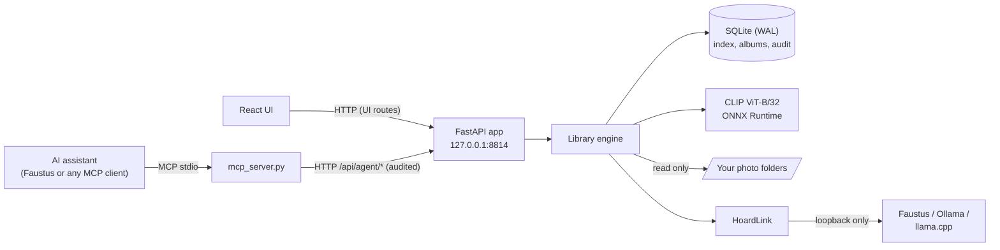

# Argus's Hoard

### Do you still have the photo of the dog on the beach from last summer?

**A private photo library that indexes your folders locally, understands what is in each picture, and hands a local AI model compact, honestly ranked text results -- plus one numbered contact sheet, only when the model can see images.**

[Español](README.es.md) · [Quick start](#quick-start) · [Connect to Faustus](#connect-it-to-faustus) · [MCP reference](docs/MCP.md) · [Portfolio](https://luissalet.github.io/Portfolio/#projects)


*Actual application, synthetic demo data: 87 generated images (gradients and simple shapes, not real photos) with EXIF dates, GPS for three cities, and planted duplicates.*

## Why

A language model can read a text file, but a folder of 20,000 photos is
opaque to it: it cannot tell which one shows the whiteboard from March,
where a trip was, or that three copies of the same picture are taking up
space. Pasting images into a chat does not scale, and describing photos
from their file names invites confident guesses.

Argus indexes your folders on your own machine (CLIP image
embeddings through ONNX Runtime, no PyTorch, no cloud call), reads EXIF
and GPS, reverse-geocodes offline, and finds exact and near duplicates.
The model gets short, filtered, numbered results with stable ids and a
relevance band (strong/medium/weak) on each one. A vision model can ask
for a single contact-sheet image of the candidates and check ten photos
for the price of one image before it claims anything; a text-only model
never receives an image it did not ask for. Argus
never modifies, moves or deletes an original file; that invariant is
tested.

## Use cases

Eight scenarios, each walked in the browser and, for the agent ones, over
real MCP stdio by a script that plays a small local model
([docs/USE_CASES.md](docs/USE_CASES.md); what was found and fixed is in
[docs/USABILITY_REPORT.md](docs/USABILITY_REPORT.md)):

- **First run**: add `Pictures` (a path pasted with Explorer's quotes
  works), download the image model from Settings while the bar counts the
  megabytes, and search "sunset over the sea".
- **One photo by content and date**: *"do you still have the photo of
  the dog on the beach from last summer?"* The model searches "dog on the
  beach" with a date range, gets text only, and says how sure it is.
- **Free up space**: exact copies keep the camera-roll original, and
  "Copy paths of the extra copies" leaves the keeper out; near duplicates
  are shown as "up to", to check group by group.
- **Albums by the agent**: *"make an album 'Lisboa 2024' with the whole
  trip"*: filters alone (`place="Lisbon"`, July 2024), paged with
  `next_offset`, cover the trip.
- **With other tools**: a vertical portrait for a CV that the assistant
  then copies with its own file tools, and the clapperboard and
  green-screen shots of a short-film shoot collected in one album.
- **Memories and places**: "on this day" with places, and Places grouped
  by country and city.

## What is implemented

| Area | Available now | Boundary |
| --- | --- | --- |
| Indexing | Background, incremental scans: unchanged files cost one `stat`; changed files are re-read; moved or renamed files keep their id, vector, caption and albums. Parallel hashing and decoding, progress with files/s and ETA, one unreadable file is reported instead of stopping the scan. JPEG, PNG, WebP, GIF, BMP, TIFF, HEIC/HEIF | No file-system watcher: rescans are started by the user, the agent or a new folder |
| Metadata | EXIF date with time-zone offset, camera, lens, exposure, ISO, focal length, orientation, GPS; file time as fallback, flagged as such | EXIF only; XMP sidecars are not read |
| Search | Text to image with CLIP ViT-B/32 (English queries work best; the tools tell the model to translate), similar photos, filters (date range, year, month, place, folder, camera, orientation, megapixels, GPS). Hybrid with captions when they exist | The model (about 600 MB) is downloaded only when the user clicks it in Settings. Until then a colour-only fallback is active and every result says so |
| Duplicates | Exact (BLAKE2b) and near (pHash, Hamming distance up to 6, exact multi-index lookup, union-find) with a suggested keeper (the original, not the backup or chat-app copy) and the space that extra copies use | Read-only by design: "Copy paths of the extra copies" and "Open folder", deleting is up to you. A near group can join different look-alike photos, so its space is shown as "up to" |
| Places and time | Offline reverse geocoding (bundled 10-city table, or GeoNames `cities1000` on request, where a neighbourhood is labelled with the city it belongs to: "Alfama, Lisbon, Portugal"), countries and cities with photo counts, timeline by year and month, "on this day" | No map tiles, to avoid any network request for a view. The bundled table places nothing more than 50 km from its 10 cities |
| Captions | Optional, from a local vision model found through the shared backend (see below), per photo or as a background batch, stored in a full-text index for hybrid search | Off by default; never generated during indexing |
| Albums | Created by you or the agent from the lightbox or by tool call; the agent can only add | No nested albums |
| Interface | React desktop-style UI: thumbnail grid with infinite scroll, lightbox with zoom and pan on a large (1600 px) preview of the original, EXIF panel, similar strip, English and Spanish, light and dark | Sidebar sections are not deep-linkable URLs |
| Assistant integration | `faustus-plugin.json`, 9 MCP tools over stdio, every agent call audited in "Assistant activity" | The agent can add a folder but not remove one |
| Shared models | Captions and query translation share whatever model server Faustus or a local Ollama/llama.cpp/OpenAI-compatible server already has running (Settings -> Shared models shows what resolved and why, with a manual override) | Image search itself (CLIP) is always local, never shared: it is not a chat model the shared backend covers |

## Shared models

Argus never loads its own copy of a language or vision model. Two features
go through [HoardLink](https://github.com/Luissalet/HoardLink), a small
resolver vendored into each app that shares models on the same machine: photo **captions** (the `vision` capability) and
automatic **query translation** for the search box (the `llm` capability).
Resolution order is always the same: an explicit override set in Settings,
then a running Faustus, then a loopback Ollama / llama.cpp / OpenAI-compatible
server -- whichever is already serving a fitting model, so Argus never
asks a GPU to load a second copy. Both features simply say so and stay off
when nothing resolves (their buttons are disabled with the reason); the rest of Argus (indexing, search, duplicates,
timeline, places, albums) works fully offline with no model at all. See
[docs/ARCHITECTURE.md](docs/ARCHITECTURE.md#shared-model-backend-hoard-link).


*Actual application: neither Faustus nor a local Ollama/llama.cpp server is running in this demo, so both capabilities honestly report "Not available" with the reason why.*

## Connect it to Faustus

Argus is a plugin for [Faustus](https://github.com/Luissalet/Faustus), a
local AI workspace, and declares itself with `faustus-plugin.json`. Start
the app, then in Faustus open **Connectors -> Nearby apps -> Add**. Faustus finds it on
`127.0.0.1:8814`, reads the manifest from the app's working directory and
launches the MCP adapter itself.

| Tool | What | Read-only |
| --- | --- | --- |
| `photos_search` | Text (English) -> photos with relevance bands, filters, paging; a numbered contact sheet only on request | yes |
| `photos_similar` | Photos that look like a given one | yes |
| `photos_show` | Up to 4 images for a closer look (200 KB each at most) | yes |
| `photos_describe` | EXIF, place, path; optional local caption | yes (a requested caption is saved in Argus's database) |
| `photos_duplicates` | Exact or near duplicate groups with a keeper | yes |
| `photos_timeline` | Counts per year and month, "on this day" | yes |
| `photos_library` | Folders, counts, active model, running jobs | yes |
| `photos_add_folder` | Register a folder and index it | adds only |
| `photos_album` | Create or extend an album | adds only |

It works with any MCP client over stdio:

```json
{
  "mcpServers": {
    "argus": {
      "command": "C:/path/to/argus-hoard/.venv/Scripts/python.exe",
      "args": ["C:/path/to/argus-hoard/argus_hoard/mcp_server.py"],
      "env": { "ARGUS_URL": "http://127.0.0.1:8814" }
    }
  }
}
```

On Linux or macOS the interpreter is `argus-hoard/.venv/bin/python`.

Arguments, output shapes, error codes and limits: [docs/MCP.md](docs/MCP.md).
The skill that tells the model when and how to use the tools:
[skills/find-photos/SKILL.md](skills/find-photos/SKILL.md).


*Actual application: "sunset over the sea" with the real CLIP model on the synthetic demo images.*


*The lightbox: preview of the original, EXIF, place, captions, albums and visually similar photos.*

## Quick start

Requirements: Python 3.11 or newer and Node.js 22 (only to build the
interface once). The image model is not bundled: Settings -> Image model
downloads it (about 600 MB) when you ask; until then search works on
colours only and says so.

### Windows (PowerShell)

```powershell
git clone https://github.com/Luissalet/ArgusHoard.git
cd ArgusHoard
.\scripts\start.ps1 -Demo      # first run: creates .venv, installs the lock, builds the UI, opens the browser
```

Or double-click **`Iniciar Argus.cmd`** (and **`Detener Argus.cmd`** to
stop). More launcher options:

```powershell
.\scripts\start.ps1              # your own library in data\
.\scripts\start.ps1 -Port 8820 -NoBrowser
.\scripts\stop.ps1
```

`start.ps1` prefers Python 3.13 when it is installed in `C:\Python313`,
reinstalls dependencies whenever `requirements-lock.txt` changes, starts
the app hidden with the repository as working directory, waits for
`/api/health` and opens the browser. Logs go to `data\logs\`.
`stop.ps1` stops the process listening on the port after confirming it is
Argus.

The same steps by hand:

```powershell
python -m venv .venv
.venv\Scripts\python -m pip install -r requirements-lock.txt
cd frontend; npm ci; npm run build; cd ..
.venv\Scripts\python -m argus_hoard --demo     # synthetic library in data-demo\
.venv\Scripts\python -m argus_hoard            # your own library, http://127.0.0.1:8814
```

### Linux / macOS

```bash
git clone https://github.com/Luissalet/ArgusHoard.git
cd ArgusHoard
python3 -m venv .venv
.venv/bin/python -m pip install -r requirements-lock.txt
(cd frontend && npm ci && npm run build)
.venv/bin/python -m argus_hoard --demo --no-browser   # synthetic library in data-demo/
curl http://127.0.0.1:8814/api/health                 # {"service":"argus-hoard",...}
```

Then open <http://127.0.0.1:8814>. Flags: `--port`, `--data-dir` (or
`ARGUS_DATA_DIR`), `--demo`, `--no-browser`. Everything Argus writes lives
in the data folder (`data/` by default, `data-demo/` with `--demo`):
database, thumbnails, vectors, model cache, logs.

## Architecture

FastAPI and SQLite (WAL) around a plain-Python engine, a React 19 + Vite
interface, and a standalone MCP adapter that talks to the app over HTTP.
Modules, data model, the indexing pipeline, threads and the duplicate
index are described in [docs/ARCHITECTURE.md](docs/ARCHITECTURE.md).




*Near duplicates in the demo library: each planted downscaled copy is grouped with its original, keeper first.*


*Timeline: months with sample thumbnails; a month opens its photos.*

## Development

```bash
.venv/bin/python -m pytest -q            # 141 tests, about 30 s, no network, no GPU
.venv/bin/python -m pytest -q -m model   # 1 opt-in test with the real CLIP model (downloads it if missing)
(cd frontend && npm ci && npm run build) # TypeScript strict
```

(On Windows: `.venv\Scripts\python -m pytest -q`.)

The default suite covers: originals untouched after indexing, duplicates
and album work; incremental rescans; moved files keeping their id;
corrupt files not stopping a scan; serialised concurrent scans; the data
folder never indexed as photos; re-embedding after an embedder change;
EXIF as cameras write it (sub-IFD, tuples, zeroed dates) and GPS signs;
thumbnail orientation; every supported format including HEIC; the
near-duplicate index against brute force on 8,000 hashes; union-find and
the keeper rule; contact-sheet and `photos_show` size caps;
fallback-embedder ranking and its determinism across processes; the
vector store; reverse geocoding on a fixture, including parent cities
from real GeoNames rows; filter validation, paging and an empty result
naming the filter to relax; the HTTP guard, path traversal attempts and
error shapes; the manifest; the MCP adapter spawned over stdio against a
live app (tool list, annotations, contact-sheet image, `photos_show`,
albums, errors, and the message when the app is down); and the shared
model backend (overrides that never return the Faustus token, captions
through a mocked server, a caption batch that yields to and postpones for
a busy model, a broken `backend.json`, and query translation only on the
UI route). The model test indexes the demo scenes with real CLIP and
checks that four English descriptions find the right scene.

CI (`.github/workflows/ci.yml`) runs the suite on Ubuntu and Windows with
Python 3.11, 3.12 and 3.13, builds the UI with Node 22, and drives
`start.ps1`/`stop.ps1` on Windows.

## Privacy and security

- Binds to `127.0.0.1` only; requests with another `Host` header (DNS
  rebinding) and cross-site writes are rejected. No CORS, no telemetry.
- The only internet requests are the ones you start in Settings: the CLIP
  model from Hugging Face and the GeoNames dataset. Captions and query
  translation only talk to model servers on loopback (Faustus, Ollama,
  llama.cpp or another OpenAI-compatible server).
- Every assistant call is recorded under **Assistant activity** (tool,
  arguments, duration, result or error); the interface's own clicks use
  separate routes and are not mixed in.
- Originals are only read. Removing a folder in Settings forgets Argus's
  own data about it (index rows, thumbnails, album entries), never the
  files. The agent can add folders and albums but not remove anything.
- Place names come from [GeoNames](https://www.geonames.org/) (CC BY 4.0)
  when the full dataset is downloaded.

## Known limits and roadmap

- No file-system watcher: rescans are started by you, the agent or a new
  folder.
- Vector search is brute-force cosine: fine to about 200,000 photos on one
  machine; an ANN index can sit behind the same interface later.
- A near-duplicate group can chain different look-alike photos, which is
  why its space is shown as "up to"; a tighter grouping (bounded group
  diameter, a CLIP check) needs validating on real photos first.
- Byte-identical copies can still appear side by side in search results
  and albums.
- There is no first-run checklist yet: an amber banner and the Settings
  badge point to the image model download.
- A few reasons and country names still appear in English in the Spanish
  interface.
- CLIP relevance bands and near-duplicate thresholds were tuned on
  synthetic images; they need a check on large real libraries.

Design notes from the use-case walkthroughs: [docs/USE_CASES.md](docs/USE_CASES.md),
[docs/USABILITY_REPORT.md](docs/USABILITY_REPORT.md).

## License

[MIT](LICENSE).
